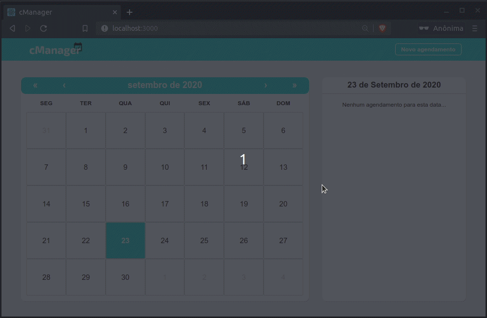

<p align="center">
  
</p>

<h1 align="center">cManager</h1>

<h4 align="center"> 
	🚧  Frontend em construção...  🚧
</h4>

<p align="center">
  <a href="#page_with_curl-sobre">Sobre</a>&nbsp;&nbsp;&nbsp;|&nbsp;&nbsp;&nbsp;
  <a href="#books-tecnologias">Tecnologias</a>&nbsp;&nbsp;&nbsp;|&nbsp;&nbsp;&nbsp;
  <a href="#rocket-clonar-o-repositório">Iniciando</a>&nbsp;&nbsp;&nbsp;|&nbsp;&nbsp;&nbsp;
  <a href="#gear-iniciar-o-back-end">Backend</a>&nbsp;&nbsp;&nbsp;|&nbsp;&nbsp;&nbsp;
  <a href="#computer-iniciar-o-front-end">Frontend</a>
</p>

<div align="center">
  
</div>

## :page_with_curl: Sobre

O cManager nada mais é que uma plataforma web de agendamentos que pode ser utilizado por qualquer pessoa.

Nesta aplicação o usuário pode agendar tarefas/compromissos para qualquer data e ter uma visão geral de seus agendamentos, além de poder editar ou excluir cada item.

O cManager é uma aplicação web com layout responsivo, permitindo que seja acessado pelo celular ou computador sem afetar a experiência do usuário.

### Features

- [x] Agendamentos de horários
- [x] Listagem de agendamentos
- [x] Edição de agendamento
- [x] Exclusão de agendamentos
- [ ] Tarefas diárias
- [ ] Autenticação

## 🛠 Tecnologias

Tecnologias utilizadas na construção do projeto:

- [Node.js](https://nodejs.org/en/)
- [React](https://reactjs.org/)
- [SWR](https://swr.vercel.app/)
- [Knex.js](https://knexjs.org/)
- [TypeScript](https://www.typescriptlang.org/)

### :books: Requisitos

Antes de começar, você vai precisar ter instalado em sua máquina as seguintes ferramentas:
[Git](https://git-scm.com), [Node.js](https://nodejs.org/en/). 
Além disto é bom ter um editor para trabalhar com o código como [VSCode](https://code.visualstudio.com/).


## :gear: Clonar o repositório
``` bash
  # Clonar o projeto:
  $ git clone https://github.com/alemon-ice/cManager.git

  # Entrar no diretório do projeto:
  $ cd cManager
```

## :rocket: Iniciar o servidor back-end
```bash
  # Entrar no diretório do servidor back-end:
  $ cd server

  # Instalar as dependências:
  $ npm install

  # Criar o Banco de dados:
  $ npm run knex:migrate

  # Iniciar o servidor:
  $ npm run dev:server
```

## :computer: Iniciar o front-end web
```bash
  # Entrar no diretório do front-end:
  $ cd frontend

  # Instalar as dependências:
  $ npm install

  # Iniciar a aplicação web:
  $ npm run start
```


## 📝 Licença

Este projeto está sob a licença MIT.

Feito com ❤️ por Rafael Dias 👋🏻 [Get in touch!](https://github.com/alemon-ice)